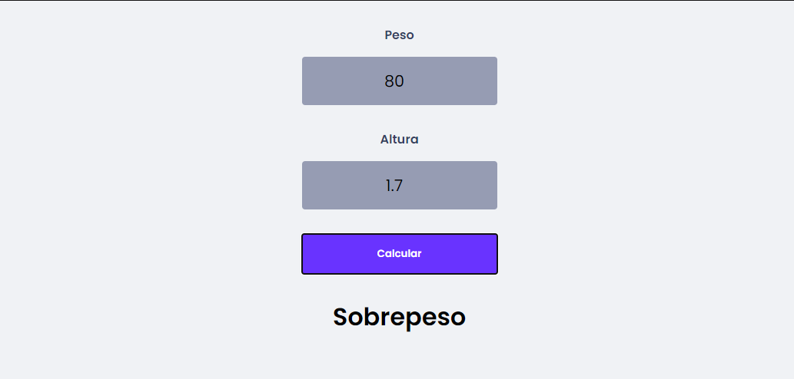

<h2 style="text-align: center">
    Calculadora IMC
</h2>

O objetivo desse projeto é praticar os conhecimentos em ReactJS, assim como a estrutura do HTML e CSS. os desafios enfrentados nesse sistema foram o uso de Hooks (useState), styled-components e componentização.

Link do projeto [Clique aqui](https://calculadora-imc-miluksandrades.vercel.app/)

As ferrementas utilizadas são:

- ReactJS
- Styled Components

Para iniciar o projeto utilize o comando `yarn start`